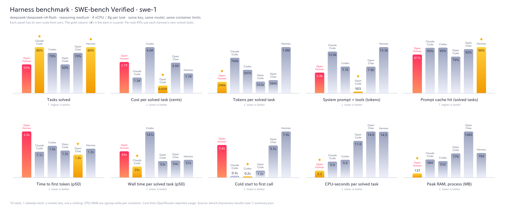

# Cross-harness benchmark

Runs OpenHuman, Claude Code, Codex, OpenCode, OpenClaw and Hermes on the same
tasks with the same model, the same OpenRouter key and the same reasoning
level, inside identically limited containers, and reports resource use,
latency, cache efficiency, prompt size, cost and SWE-bench Verified resolve rate.

## How the comparison is kept fair

| Control | Mechanism |
|---|---|
| Same model | The metering proxy rewrites `model` on every request to `BENCH_MODEL`. |
| Same provider | The proxy pins `provider: {order: [BENCH_PROVIDER], allow_fallbacks: false}` on every request, so the prompt cache is not split across OpenRouter backends. |
| Same reasoning level | The proxy strips each protocol's own spelling (`thinking`, `reasoning_effort`, ...) and injects `reasoning: {effort: BENCH_REASONING}`. |
| Same key | Only the proxy holds `OPENROUTER_API_KEY`; harnesses get a dummy token. |
| Same resources | One compose `task` service: `cpus: 4`, `mem_limit: 8g`, no swap, same for every harness. |
| Same metering | Latency, TTFT, tokens, cache and cost are measured by the proxy from the wire, not from each harness's own accounting. |
| Same tasks | Fixed instance list (`swebench/instances-10.txt`, seeded, pinned dataset revision) and a single prompt wrapper. |
| Same grader | The official `swebench.harness.run_evaluation`. |

The proxy logs what each harness *tried* to send (`overridden`), so a harness
that insists on a different model or effort is visible rather than silently
normalised.

## Layout

```
docker-compose.yml     meter-proxy + the `task` service (limits live here)
meter-proxy/           wire parsers (chat / Anthropic / Responses), pricing, proxy, capture
viewer/                zero-dependency web UI over results/ (prompts, tools, cache diagnostics)
runner/                in-container entry (cgroup CPU/RAM sampler, patch capture, check)
bundles/               per-harness build (/opt/harness) + adapters/*.sh headless entry points
tasks/micro.mjs        5-task micro suite generator
swebench/              prepare.py (select + task dirs), grade.mjs (official evaluator)
orchestrate.mjs        host driver: tags the proxy, runs one container per task
report.mjs             merges everything into results/<run>/summary.{json,md}
harnesses.lock         pinned harness versions
```

## Run it

```bash
export OPENROUTER_API_KEY=...          # or put it in .env (see .env.example)
export BENCH_UID=$(id -u) BENCH_GID=$(id -g)

# 1. build harness bundles (once; openhuman compiles the core, ~10-20 min cold)
for h in claude-code codex opencode openclaw hermes deepseek-harness deepseek-harness-minimal openhuman; do ./bundles/build.sh $h; done

# 2. micro suite (cheap smoke test of every adapter, cold start, steady state)
for h in claude-code codex opencode openclaw hermes openhuman; do
  node orchestrate.mjs --harness $h --suite micro --run-id micro-1 --repeat 3
done
node report.mjs --run-id micro-1

# 3. SWE-bench Verified, 10 instances
uv venv --python 3.12 .cache/swebench-venv
uv pip install --python .cache/swebench-venv/bin/python swebench datasets
.cache/swebench-venv/bin/python swebench/prepare.py --n 10 --out tasks/generated/swe --pull
for h in claude-code codex opencode openclaw hermes openhuman; do
  node orchestrate.mjs --harness $h --suite swe --tasks-dir tasks/generated/swe --run-id swe-1
  node swebench/grade.mjs --run-id swe-1 --harness $h
done
node report.mjs --run-id swe-1
```

Harnesses run one at a time on purpose: two harnesses sharing the host would
contend for CPU and distort the CPU and latency columns.

## Seeing what each harness sends

The proxy sits between every harness and OpenRouter, so it records the request as the
harness built it (before model/reasoning are pinned). Per run, under
`results/<run>/captures/`: one JSON per call (`<harness>/<task>/<seq>.json`) holding the
sampling parameters, headers (credentials dropped), `cache_control` marker count, any
`prompt_cache_key`, the raw response, and, for caching, whether the system prompt and tool
list matched the previous call and how many earlier messages were re-sent byte-for-byte.
System prompts, tool schemas and messages are stored once each in `captures/blobs/`, so a long
task costs the system prompt once. `METER_CAPTURE=0` turns it off.

```bash
node viewer/server.mjs            # http://127.0.0.1:8787, read-only, loopback, reads files on demand
node viewer/server.mjs --port 9000 --results /path/to/results
./run-deepseek.sh                 # DeepSeek harness (minimal + full) micro suite, one at a time
```

The viewer shows per-harness aggregates (tokens, cache %, cost, system-prompt and tool-schema
size, rejected overrides), the system prompt each harness actually sent, tool schemas, every
call's cache diagnostics, the conversation, and the provider's raw response.

## Charts

```bash
node report.mjs --run-id swe-1                 # writes results/swe-1/summary.json
node charts.mjs --run swe-1 --png              # results/swe-1/charts.{svg,png}
node charts.mjs --run swe-1 --theme dark --png
node charts.mjs --run swe-1 --only resolved,cost_task,cache   # a subset of panels
```

One panel per KPI, one column per harness, OpenHuman highlighted, each panel on its own
scale from zero, with a star on the best column (direction-aware). The SVG has no
dependencies; `--png` installs `@resvg/resvg-js` into `.cache/` on first use. Rendered
examples are in `charts/`.



## Metrics

- **CPU / RAM**: container-wide cgroup v2 (`cpu.stat usage_usec`, `memory.current`,
  kernel `memory.peak`), sampled at 2 Hz around the harness only (setup and the
  correctness check are not charged). Memory includes page cache.
- **TTFT / latency / cache % / tokens**: from the proxy. TTFT is time from the
  request being sent upstream to the first reasoning-or-text token. Cache % is
  cached prompt tokens over all prompt tokens across a task's calls.
- **System prompt size**: first request of each task, tokenised with o200k_base.
  Reported as system prompt, tool schemas, and their sum: harnesses differ in
  whether the tool catalogue is API `tools` or text inside the system prompt, so
  only the sum is comparable.
- **Cost**: OpenRouter's reported `usage.cost` when present, otherwise computed
  from the model's price list with the cached-token discount (`cost_source` in
  `meter.jsonl` says which). Also cost per resolved task.
- **Cold start**: harness start to its first model call.

## Harness lineup

`openhuman` (native only: provider JSON tool calls, `OPENHUMAN_TOOL_DISPATCHER=native`; no other variants), `claude-code`, `codex`, `opencode`, `openclaw`,
`hermes`, `deepseek-harness` (DeepSeek's `dsh` through its Python SDK, full `sdk` profile) and
`deepseek-harness-minimal` (the `sdk-minimal` profile, a shell only, which DeepSeek's own
`BENCHMARK.md` prescribes). `openhuman-python` is the retired python-dispatcher default: its
data stays under `results/` but it is excluded from reports and charts (`--include-archived`
brings it back). `rename-harness.mjs` relabels a finished run's data when a variant is promoted.

Only one benchmark may run on a host at a time: `orchestrate.mjs` waits while another
`orchestrate.mjs` or a SWE-bench grading run is active, and each checkout gets its own compose
project and proxy port, so two worktrees never share a proxy.

## Caveats

- Ten tasks with one attempt is a smoke test, not a ranking.
- Container networking is not locked down. Harnesses can reach the internet
  (task images are pre-baked, so the SWE tasks do not need it).
- OpenHuman reaches the proxy through a loopback forwarder (it refuses to send a
  bearer to a non-loopback `http` endpoint); the forwarder is a few KB of node.
- Hermes's installer clones its `main` branch rather than the tag in
  `harnesses.lock`; the commit used is whatever `main` was at bundle build time.
  Hermes also copies its installed tree to a writable `HOME` at start, which
  counts in its cold start.
- Claude Code needs `IS_SANDBOX=1` to accept the permission bypass as root.
- Codex only speaks the Responses API; this works because OpenRouter serves
  `/v1/responses`.
